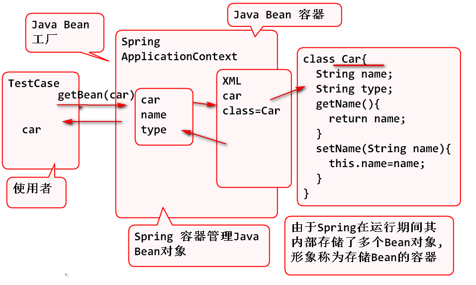

2018年6月14日  Spring Day01

# Spring

##  Java Bean

类的定义,符合如下规则的Java对象称为Java Bean

1. 必须有包
2. 必须有无参数构造器
3. 必须实现 序列化接口
4. 有getXXX setXXX 方法声明的"Bean属性".
	- Bean属性 不是 对象属性
	- boolean类型的 get属性方法,可以声明为 isXXX

> Java Bean就是符合一定规范的Java对象!

## Spring 

Spring 是开源社区提供的软件框架

1. 提供了软件中必须使用的大部分功能
2. 只要按照Spring约定的规则使用, 就可以利用这些功能
3. 利用Spring可以大大简化软件的开发

Spring 两大核心功能: IOC 和 AOP

> 先学 IOC 在项目阶段学习 AOP

## Spring IOC

Spring IOC 用于管理(创建,修改属性等)Java Bean对象.

1. Spring IOC 可以创建Java Bean对象
2. Spring IOC 可以修改Bean属性
3. Spring IOC 可以作为 Java Bean的工厂使用

> 由于Spring 中存储的是JavaBean 对象, 所以也称Spring是Java Bean容器.

## Spring管理JavaBean

原理:

步骤:

1. 导入Spring组件

		<dependency>
			<groupId>org.springframework</groupId>
			<artifactId>spring-context</artifactId>
			<version>4.3.9.RELEASE</version>
		</dependency>

		<dependency>
			<groupId>junit</groupId>
			<artifactId>junit</artifactId>
			<version>4.12</version>
		</dependency>

	> JUnit 用于进行测试

2. 编写Java Bean 类 Car

		public class Car implements Serializable {

			private String name;
			private String type;

			public Car() {
			}

			public String getName() {
				return name;
			}

			public void setName(String name) {
				this.name = name;
			}

			public String getType() {
				return type;
			}

			public void setType(String type) {
				this.type = type;
				System.out.println("Call setType"); 
			}

			@Override
			public String toString() {
				return "Car [name=" + name + ", type=" + type + "]";
			}

		}

3. 更新Spring配置文件 applicationContext.xml

		<?xml version="1.0" encoding="UTF-8"?>
		<beans xmlns="http://www.springframework.org/schema/beans" 
			xmlns:xsi="http://www.w3.org/2001/XMLSchema-instance"
			xmlns:context="http://www.springframework.org/schema/context" 
			xmlns:jdbc="http://www.springframework.org/schema/jdbc"  
			xmlns:jee="http://www.springframework.org/schema/jee" 
			xmlns:tx="http://www.springframework.org/schema/tx"
			xmlns:aop="http://www.springframework.org/schema/aop" 
			xmlns:mvc="http://www.springframework.org/schema/mvc"
			xmlns:util="http://www.springframework.org/schema/util"
			xmlns:jpa="http://www.springframework.org/schema/data/jpa"
			xsi:schemaLocation="
				http://www.springframework.org/schema/beans http://www.springframework.org/schema/beans/spring-beans-3.2.xsd
				http://www.springframework.org/schema/context http://www.springframework.org/schema/context/spring-context-3.2.xsd
				http://www.springframework.org/schema/jdbc http://www.springframework.org/schema/jdbc/spring-jdbc-3.2.xsd
				http://www.springframework.org/schema/jee http://www.springframework.org/schema/jee/spring-jee-3.2.xsd
				http://www.springframework.org/schema/tx http://www.springframework.org/schema/tx/spring-tx-3.2.xsd
				http://www.springframework.org/schema/data/jpa http://www.springframework.org/schema/data/jpa/spring-jpa-1.3.xsd
				http://www.springframework.org/schema/aop http://www.springframework.org/schema/aop/spring-aop-3.2.xsd
				http://www.springframework.org/schema/mvc http://www.springframework.org/schema/mvc/spring-mvc-3.2.xsd
				http://www.springframework.org/schema/util http://www.springframework.org/schema/util/spring-util-3.2.xsd">
			<!-- 告诉Spring 帮助创建一个Car对象 -->
			<!-- bean 标签用于创建JavaBean对象 -->		
			<bean id="car" class="spring.day01.Car">
			</bean>
		</beans>

4. 测试:
		
		public class TestCase {
			
			
			@Test
			public void testCar(){
				//初始化 Spring 容器, Spring 会根据xml
				//文件自动创建 Java bean 对象
				ApplicationContext ctx=
					new ClassPathXmlApplicationContext(
					"applicationContext.xml");
				
				//从Spring容器中获取Spring创建的Bean对象
				// "car" 是 在xml中定义的 id 属性值
				Car car=(Car)ctx.getBean("car");
				System.out.println(car); 
				
				Car car1 = (Car) ctx.getBean("car1");
				System.out.println(car1);
				
				//重载的 getBean 方法可以避免类型转换
				Car c = ctx.getBean("car",Car.class);
			}
			
		}

## Spring 可以管理Bean 的属性

Bean属性注入: 修改"Bean属性" 不是对象的属性! 实际上是调用了setXXX方法, 修改了Bean属性.

	<bean id="car" class="spring.day01.Car">
		<!-- property 标签用于注入Bean属性 
			name 是bean属性名, 如果是type则调用
			setType方法! -->
		<property name="type" value="QQ"></property>
	</bean>

## 工厂方法

1. 简单理解就是利用方法创建对象
2. 将对象复杂的创建过程封装到方法中
3. 使用时候调用方法就重用了复杂的对象创建过程, 简洁的得到对象.

静态工厂方法:

	Connection getConnection() 

	Connection conn=DBUtils.getConnection();

	Calendar rightNow = Calendar.getInstance();

动态工厂方法:

	Statement st = conn.createStatement();

	Time time = cal.getTime();

## Spring 创建对象的3种方式

Spring 帮助创建JavaBean对象, Spring 支持3种对象创建方式

1. 利用构造器创建Java Bean
2. 利用静态"工厂方法"创建对象
3. 利用动态工厂方法创建对象

案例:

	<!-- 利用静态工厂方法创建Java Bean对象 -->
	<bean id="cal" class="java.util.Calendar"
		 factory-method="getInstance"></bean>
	
	<!-- 利用bean(对象)的工厂方法创建对象-->
	<!-- Spring会调用cal对象的getTime方法创建对象 -->
	<bean id="time" factory-bean="cal"
		factory-method="getTime"></bean>

测试:

	@Test
	public void testCal(){
		//初始化 Spring 容器
		ApplicationContext ctx=
			new ClassPathXmlApplicationContext(
			"applicationContext.xml");
		
		//获取Java Bean, 进行测试
		Calendar cal=ctx.getBean(
				"cal", Calendar.class);
		System.out.println(cal); 
	}
	
	@Test
	public void testTime(){
		//初始化Spring 容器
		ApplicationContext ctx=
			new ClassPathXmlApplicationContext(
			"applicationContext.xml");
		
		//检查是否成功创建了 time 对象
		Date time=ctx.getBean(
				"time", Date.class);
		System.out.println(time); 
	}

## Bean 的作用域

1. Spring 在默认情况下, 其中Bean都是单例的!
	- 单例:　在软件中一个永远唯一的对象，称为单例！
2. 设置 scope="prototype" 以后就是多例的对象了

案例:

	<!-- 设置 scope="prototype" 
	  scope 范围 prototype 原型 
	  设置 scope="prototype" 属性后, Spring会在
	  每次调用 getBean时候创建对象! Spring会为对象
	  创建多个实例! 也就是多例的!-->
	<bean id="time2" scope="prototype" 
		factory-bean="cal"
		factory-method="getTime"></bean>

## Bean 的生命周期管理

Spring 中的Bean对象, 由Spring控制对象的创建和销毁, 这个过程称为Spring中Bean对象的生命周期管理.

1. 单例对象 singleton(单例)
	- 创建: 在Spring容器初始化时候, 创建单例对象, 如果设置了init-method属性, 则在创建对象以后调用初始化方法.
	- 使用: 每次调用getBean时候, 返回的都是同一个对象
	- 销毁: 在Spring容器关闭时候,Spring会自动销毁单例对象, 如果指定了destroy-method属性, 则会在销毁之前执行 销毁 方法.

2. 多例对象 prototype(原型)
	- 创建: 在调用getBean方法时候, 创建对象, 如果设置了init-method属性, 则在创建对象以后调用初始化方法.
	- 使用: 每次调用getBean时候, 返回的都是新对象
	- 销毁: Spring 不管!!! 也不会调用 destroy-method !!!