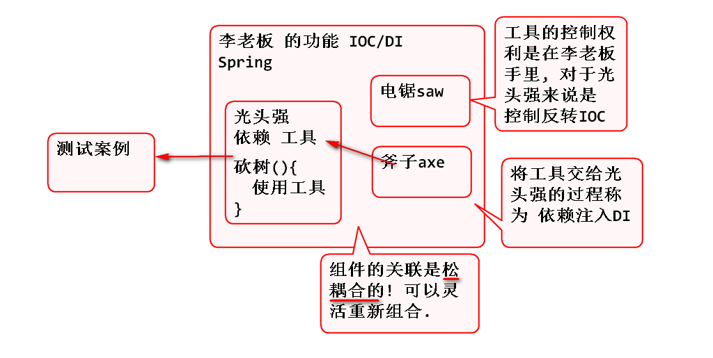
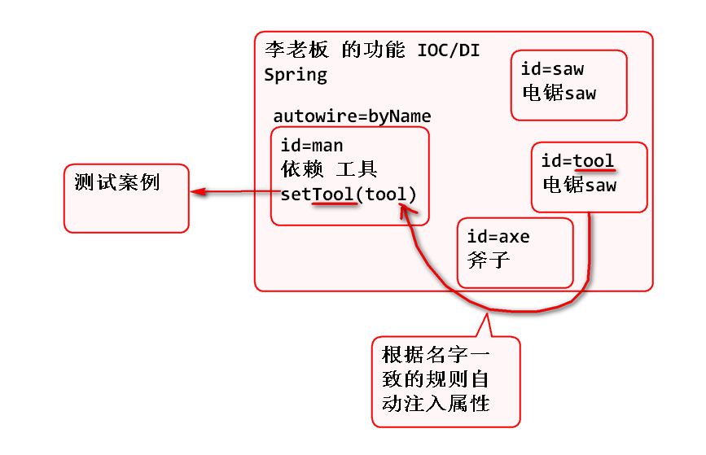
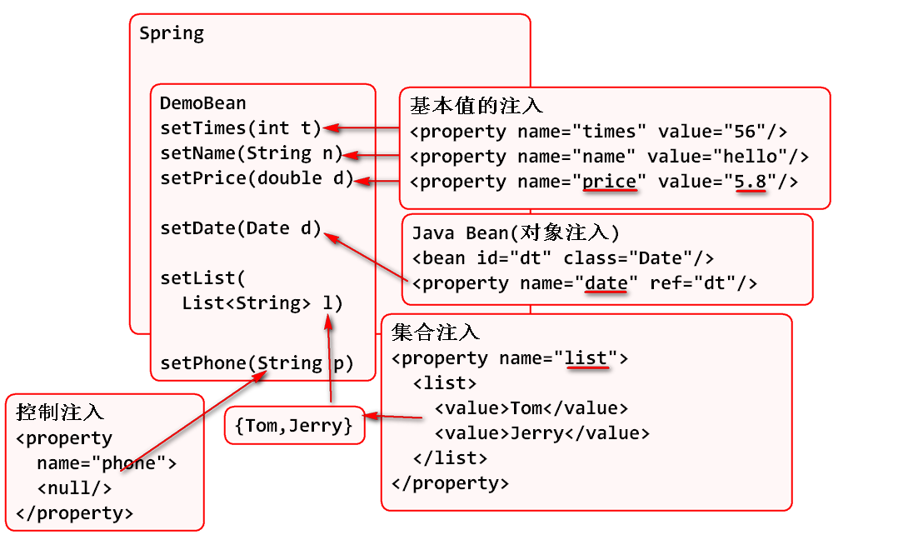
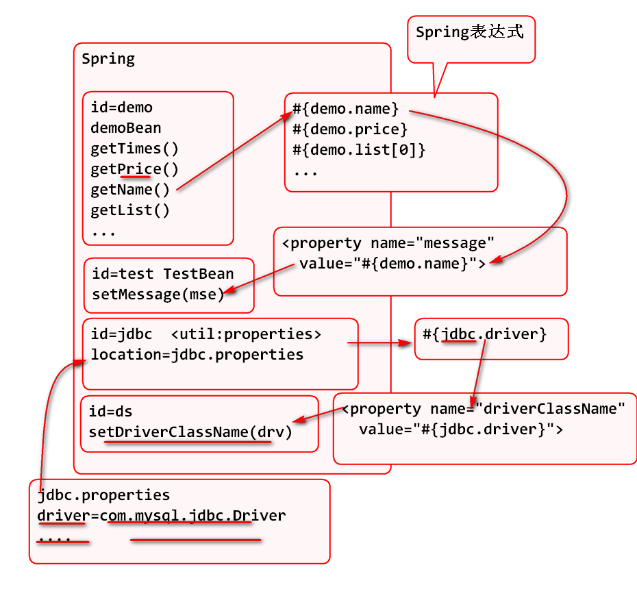
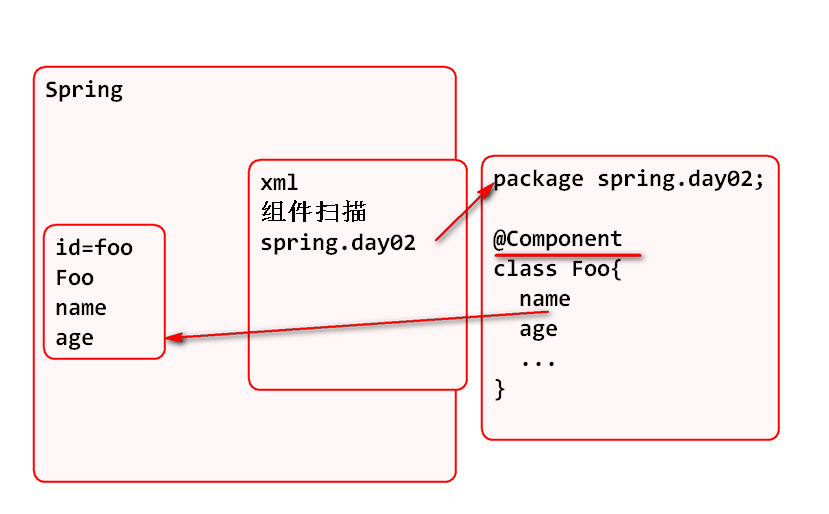
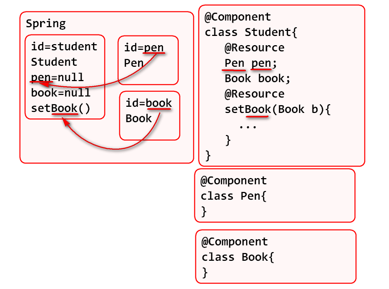

982018年6月15日  Spring Day02

## Bean 生命周期与延迟实例化

问题:

单例对象默认情况下在容器启动时立即初始化, 如果这些对象内存耗用高, 则启动会很慢.

解决办法:

对于内存占用高, 使用少的对象, 可以设置延迟(懒惰,按需)实例化, 
在bean标签上使用懒惰属性设置即可.

设置了懒惰属性为true: 

1. 容器启动时候, bean不实例化
2. 在第一个次getBean时候实例化
3. 是单例bean对象.

> 多例对象没有延迟初始化问题.

## 什么是IOC/DI

IOC:

1. IoC全称是Inversion of Control，被译为控制反转；
2. IoC是指程序中对象的获取方式发生反转，由最初的new方式创建，转变为由第三方框架创建、注入（DI），它降低了对象之间的耦合度。
3. Spring容器是采用DI方式实现了IOC控制，IOC是Spring框架的基础和核心；

DI:

1. DI全称是Dependency Injection ，被译为依赖注入；
2. DI的基本原理就是将一起工作具有关系的对象，通过构造方法参数或方法参数传入建立关联，因此容器的工作就是创建bean时注入那些依赖关系。
3. DI主要有两种注入方式，即Setter注入和构造器注入

Setter注入(Bean属性注入)案例:

实现步骤:

1. 创建接口 Tools 

		public interface Tools {
			String getName();
		}

2. 创建 Saw

		/**
		 * 电锯
		 */
		public class Saw 
			implements Tools, Serializable {
		
			private String name;
		
			public Saw() {
				name = "电锯";
			}
			
			public String getName() {
				return name;
			}
			
			public void setName(String name) {
				this.name = name;
			}
		
			@Override
			public String toString() {
				return "Saw [name=" + name + "]";
			}
			
		}

3. 斧子 Axe

		/**
		 * 斧子 
		 */
		public class Axe 
			implements Tools, Serializable{
			private  String name;
			public Axe() {
				name = "斧子";
			}
			public String getName() {
				return name;
			}
			public void setName(String name) {
				this.name = name;
			}
			@Override
			public String toString() {
				return "Axe [name=" + name + "]";
			}
			
		}

4. 创建类型 Man

		public class Man implements Serializable {
			private Tools tool;
			private String name;
			
			public Man() {
			}
			
			public void work(){
				System.out.println(name+"使用"+
						tool.getName()+"砍树!");
			}
		
			public Tools getTool() {
				return tool;
			}
		
			public void setTool(Tools tool) {
				this.tool = tool;
			}
		
			public String getName() {
				return name;
			}
		
			public void setName(String name) {
				this.name = name;
			}
		
			@Override
			public String toString() {
				return "Man [tool=" + tool + ", name=" + name + "]";
			}
			
		}

5. 编写配置文件 applicationContext.xml:

		<bean id="axe" class="spring.day02.Axe"></bean>
		
		<bean id="saw" class="spring.day02.Saw"></bean>
		
		<!-- ref="axe" 表示将id为axe的bean对象注入
		到 bean属性tool 中! 
		ref 属性用于注入bean对象
		value 属性用于注入基本值, 包括字符串-->
		<bean id="qiang" class="spring.day02.Man">
			<property name="tool" ref="saw"></property>
			<property name="name" value="光头强"></property>
		</bean>

6. 测试:

		@Test
		public void testQiang(){
			//测试: qiang 被注入的工具是什么?
			Man qiang = ctx.getBean("qiang", 
					Man.class);
			qiang.work();
		}

	> 优点: 更换光头强的工具只需要修改配置文件即可,不需要改变任何Java代码

构造器参数注入

Spring 支持构造器参数注入:

案例:

1. 给Man增加有参数构造器:
	
		public Man(String name) {
			this.name = name;
		}
	
2. 利用配置文件调用有参数构造器

		<!-- 构造器参数注入 -->
		<bean id="miniQiang" 
			class="spring.day02.Man">
			<!-- constructor-arg 标签用于实现构造器参数
			注入, index 用与指定构造器参数序号 -->
			<constructor-arg index="0" value="小强"/>
			<property name="tool" ref="saw"/>
		</bean>
		
3. 测试:

		@Test
		public void testMiniQiang(){
			//测试: 构造器参数注入
			Man qiang = ctx.getBean("miniQiang", 
					Man.class);
			qiang.work();
		}

## 自动注入

Spring 为了简化注入,提供了自动注入功能:

案例:

当指定 autowire=byName时候, Spring会按照set方法的名字找到一致的id名一致的Bean, 并实现自动装配.

实现步骤:

1. 定义id为tool的bean

		<bean id="tool" class="spring.day02.Saw"/>

2. 在自动装配的bean上使用  autowire="byName" 

		<!-- 当指定了  autowire="byName" 属性时候,
		Spring会根据 setTool 名字查找 id为tool的
		bean , 然后自动的注入(装配) 执行setTool方法-->
		<bean id="man" class="spring.day02.Man"
			autowire="byName">
			<constructor-arg index="0" value="男人"/>
		</bean>

3. 测试:

		@Test
		public void testMan(){
			//测试: 按照名字自动参数注入
			Man man = ctx.getBean("man", 
					Man.class);
			man.work();
		}

## Spring支持各种类型的参数注入

- 注入基本值
- 注入Bean对象
- 注入集合

原理:

实现步骤:

1. 编写DemoBean

		/**
		 * 演示多种类型参数的注入
		 */
		public class DemoBean implements Serializable {

			private int times;
			private String name;
			private double price;
			private Date date;
			private List<String> list;
			private String phone="110";
			
			public int getTimes() {
				return times;
			}
			public void setTimes(int times) {
				this.times = times;
			}
			public String getName() {
				return name;
			}
			public void setName(String name) {
				this.name = name;
			}
			public double getPrice() {
				return price;
			}
			public void setPrice(double price) {
				this.price = price;
			}
			public Date getDate() {
				return date;
			}
			public void setDate(Date date) {
				this.date = date;
			}
			public List<String> getList() {
				return list;
			}
			public void setList(List<String> list) {
				this.list = list;
			}
			public String getPhone() {
				return phone;
			}
			public void setPhone(String phone) {
				this.phone = phone;
			}
			@Override
			public String toString() {
				return "DemoBean [times=" + times + ", name=" + name + ", price=" + price + ", date=" + date + ", list=" + list
						+ ", phone=" + phone + "]";
			}

		}

2. 在配置文件中注入属性:

		<!-- 多种类型的参数注入 -->
		<bean id="demo" class="spring.day02.DemoBean">
			<!-- 注入基本值 -->
			<property name="times" value="56"/>
			<property name="name" value="Hello"/>
			<property name="price" value="5.8"/> 
			<!-- 注入一个Bean对象 -->
			<property name="date" ref="dt"/>
			<!-- 注入集合 -->
			<property name="list">
				<list>
					<value>Tom</value>
					<value>Jerry</value>
				</list>
			</property>
			<!-- 注入空值 -->
			<property name="phone">
				<null/>
			</property>
		</bean>
		<bean id="dt" class="java.util.Date"/>

3. 测试:

		@Test
		public void testDemo(){
			//测试: 多种类型属性注入
			DemoBean bean = ctx.getBean(
				"demo", DemoBean.class);
			System.out.println(bean);
		}

## Spring表达式

- Spring 表达式用于读取Bean或者集合的属性
- 读取属性的目的是用于注入到bean属性中
- Spring表达式的语法与 EL 表达式基本一致
- 在实际工作中, 经常用于读取properties中的属性值, 然后注入到bean中

原理:

案例:

1. 编写jdbc.properties

		driver=com.mysql.jdbc.Driver
		url=jdbc:mysql://localhost:3306/jsd1802db
		username=root
		password=root
		initSize=3
		maxSize=3

2. 将properties读取到Spring中

		<!-- Spring 提供了标签, 读取Properties文件
		jdbc.properties文件的位置是 resources 文件夹-->
		<util:properties id="jdbc"
			location="classpath:jdbc.properties"/>

3. 利用表达式读取 properties

		<!-- 利用jdbc.properties 配置数据库连接池 -->
		<bean id="ds"
			class="org.apache.commons.dbcp.BasicDataSource"
			destroy-method="close">
			<property name="driverClassName"
				 value="#{jdbc.driver}"/>
			<property name="url"
				value="#{jdbc.url}"></property>
			<property name="username"
				value="#{jdbc.username}"></property>
			<property name="password"
				value="#{jdbc.password}"></property>
			<property name="initialSize"
				value="#{jdbc.initSize}"></property>
		</bean>

4. 测试:

		@Test
		public void testDataSource()
			throws Exception {
			//测试:利用Spring表达式注入jdbc参数
			DataSource ds=ctx.getBean(
					"ds", DataSource.class);
			Connection conn=ds.getConnection();
			System.out.println(conn);
			conn.close();
		}

## Spring 注解

Spring 提供了注解方式声明bean

1. 注解可以由Java编译器进行语法检查, 这样就可以尽可能减少配置错误.
2. 注解很多功能都是按照默认执行的, 使用更加简洁
3. 一般在项目中, 自己写的源代码中使用注解声明组件

注解的原理:

测试:

1. 编写声明组件扫描

		<!-- 设置注解组件扫描
			component: 组件, scan: 扫描	-->
		<context:component-scan
			base-package="spring.day02"/>

2. 编写测试组件

		/*
		 * Spring 会主动扫描 spring.day02包,将标注了
		 * @Component的类Foo自动实例化为Java bean, 并且
		 * 绑定id为 "foo"
		 */
		@Component
		public class Foo implements Serializable{
			private String name;
			private int age;

			public Foo() {
			}

			public String getName() {
				return name;
			}

			public void setName(String name) {
				this.name = name;
			}

			public int getAge() {
				return age;
			}

			public void setAge(int age) {
				this.age = age;
			}

			@Override
			public String toString() {
				return "Foo [name=" + name + ", age=" + age + "]";
			}

		}

3. 测试

		@Test
		public void testFoo(){
			//测试: 利用注解 @Component 实例化的bean
			Foo foo = ctx.getBean("foo",Foo.class);
			System.out.println(foo);
		}

@Component 与 @Service 功能一样:

1. 编写测试类:

		@Service
		public class Goo implements Serializable {
			String name;

			public String getName() {
				return name;
			}

			public void setName(String name) {
				this.name = name;
			}

			@Override
			public String toString() {
				return "Goo [name=" + name + "]";
			}

		}

2. 测试:

		@Test
		public void testGoo(){
			//测试: 利用注解 @Service 实例化的bean
			Goo goo = ctx.getBean("goo",Goo.class);
			System.out.println(goo);
		}

自定义bean组件ID

	@Component("k1")//自定义bean组件的id
	public class Koo implements Serializable{

		private String name;

		public String getName() {
			return name;
		}

		public void setName(String name) {
			this.name = name;
		}

		@Override
		public String toString() {
			return "Koo [name=" + name + "]";
		}

	}

> 自行测试

Bean声明周期管理注解

1. 导入 注解包:

		<dependency>
			<groupId>javax.annotation</groupId>
			<artifactId>javax.annotation-api</artifactId>
			<version>1.3.2</version>
		</dependency>

2. 编程测试案例

		@Component
		public class Wolf implements Serializable{
			public Wolf() {
				System.out.println("创建大灰狼");
			}
			@PostConstruct
			public void init(){
				System.out.println("我要吃羊");
			}
			@PreDestroy
			public void destroy(){
				System.out.println("我还会回来的!");
			}
		}

3. 测试

		@Test
		public void testWolf(){
			// 测试: 生命周期管理注解
			Wolf wolf=ctx.getBean("wolf",
					Wolf.class);
			System.out.println(wolf);
		}

## 属性注入

利用属性注入注解可以注入属性

1. @Resource可以注入Bean组件
2. @Value 可以注入基本值

原理:

步骤:

1. 编写 Pen 和 Book

		@Component
		public class Pen implements Serializable{
			public String toString() {
				return "钢笔";
			}
		}

		@Component
		public class Book implements Serializable{
			public String toString() {
				return "书本";
			}
		}

2. 编写Student

		@Component
		public class Student {
			@Resource//对象属性注入
			private Pen pen;
			private Book book;

			@Value("#{jdbc.driver}")
			private String driver;

			@Resource//Bean属性注入
			public void setBook(Book book) {
				this.book = book;
			}

			@Override
			public String toString() {
				return "Student [pen=" + pen + ", book=" + book + ", driver=" + driver + "]";
			}
		}

3. 测试:

		@Test
		public void testStudent(){
			Student st = ctx.getBean("student", 
					Student.class);
			System.out.println(st);
		}

