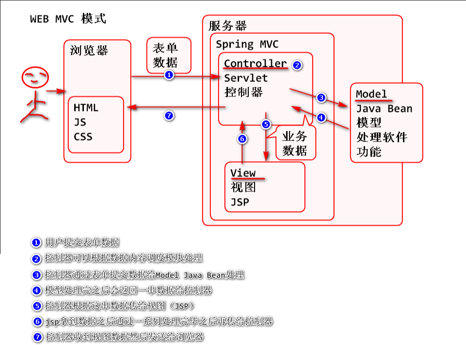
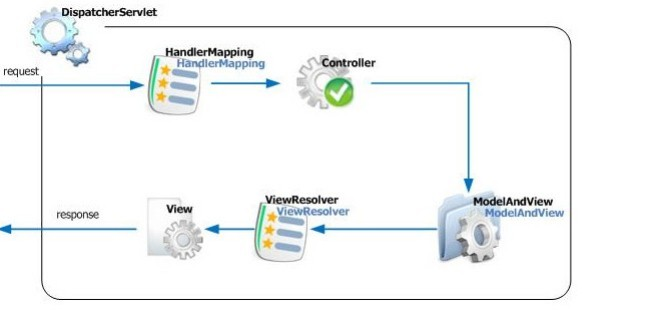
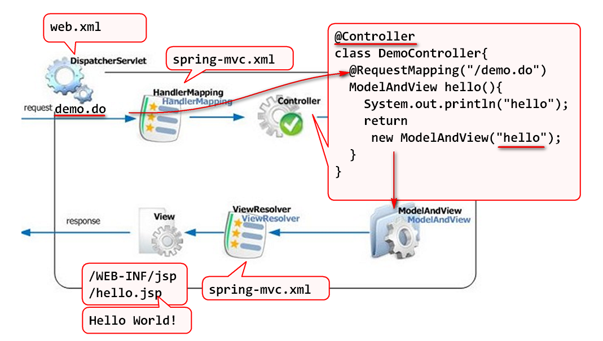
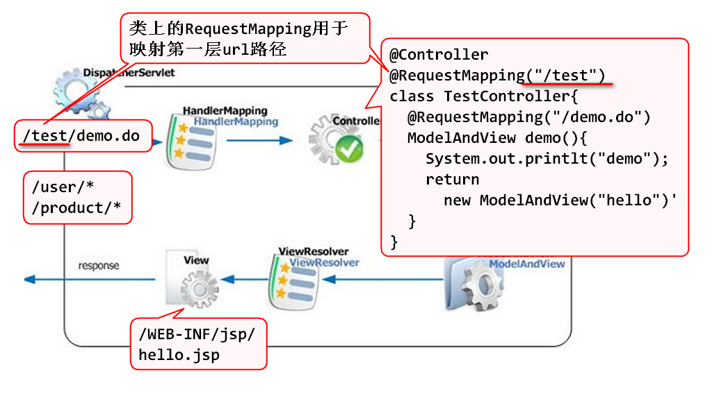
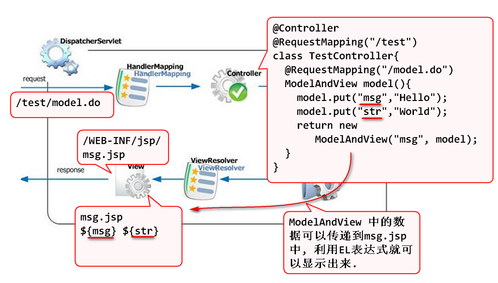
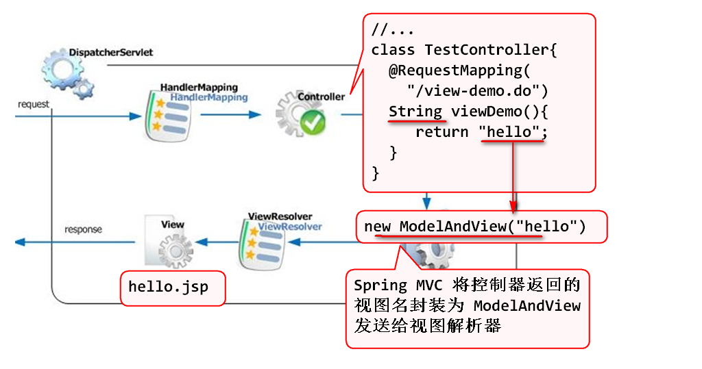
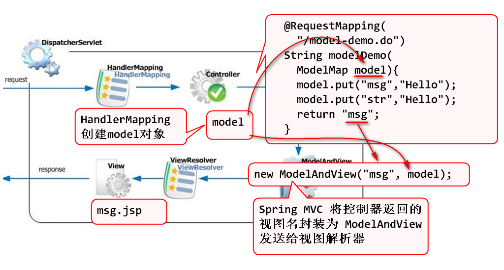
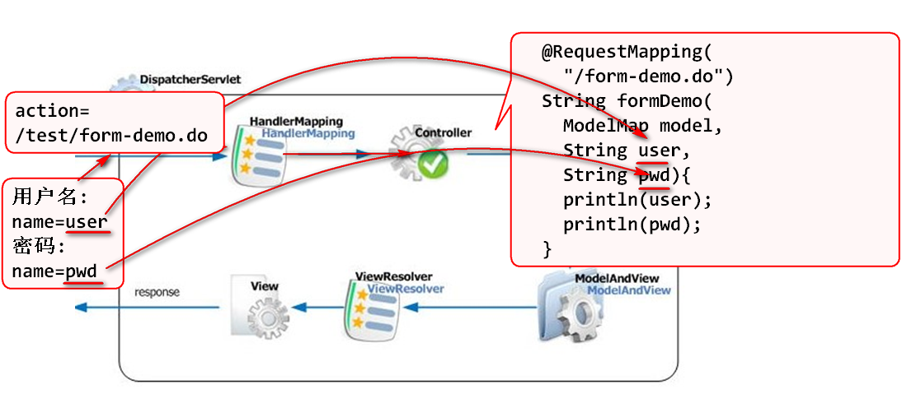
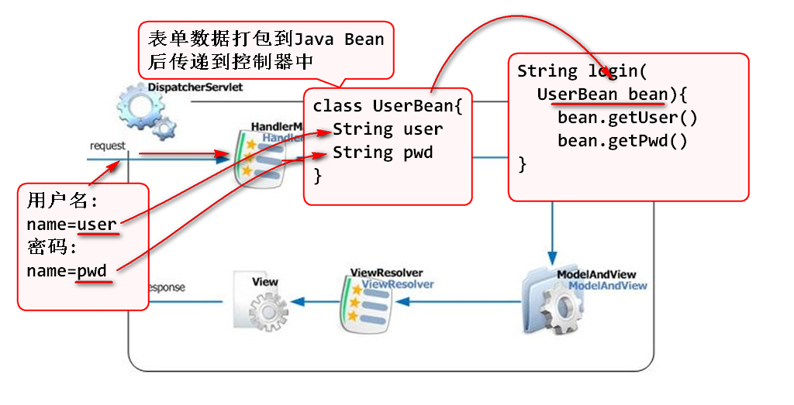

2018年6月19日  Spring Day03

# Spring MVC

Web - MVC:

- M-Model 模型
	- 模型（Model）的职责是负责业务逻辑。包含两层：业务数据和业务处理逻辑。比如实体类、DAO、Service都属于模型层。
- V-View 视图
	- 视图（View）的职责是负责显示界面和用户交互（收集用户信息）。属于视图的组件是不包含业务逻辑和控制逻辑的JSP。 
- C-Controller 控制器
	- 控制器是模型层M和视图层V之间的桥梁，用于控制流程比如：在Servlet项目中的单一控制器ActionServlet。

Spring MVC 是在Spring之上实现的 WEB MVC 编程编程框架, Spring MVC封装了大部分WEB编程中必须的功能, 只需要按照Spring MVC 定义的使用规则编程, 就可以快速的开发Web应用程序.

## Spring MVC 5大组件

1. 单一前端控制器 DispatcherServle
2. 请求处理映射器 HandlerMapping
3. 控制器组件 Controller, 需要用户编写
4. ModelAndView(视图和模型对象),是控制器方法返回值, 用于封装视图和在视图上显示的数据
5. ViewResolver 视图处理器, 用于处理视图和视图上的数据.

请求流程是:

1. 用户请求被前端控制器DispatcherServlet接收
2. 前端控制器将用户请求委托给 HandlerMapping 进行处理, HandlerMapping根据用户请求的URL找到对应的控制器. 并且执行控制器方法.
3. 控制器方法被执行, 执行后将结果封装到 ModelAndView 对象返回
4. 视图处理器 根据 ModelAndView 找到视图并且处理视图.

> 使用Spring MVC的好处是, Spring MVC 封装的常用的WEB编程功能, 使用了Spring MVC以后, 只需要写很少的代码就实现WEB编程. 

## 使用Spring MVC （面试回答用）

1. 导入spring-mvc包
2. 在 web.xml 中配置"前端控制器"
3. 为前端控制器提供 spring 配置文件
4. 在Spring配置文件中 配置 Spring MVC 的组件

具体步骤是:

1. 创建Maven Web项目
2. 导入Spring MVC包:

		<dependency>
			<groupId>org.springframework</groupId>
			<artifactId>spring-webmvc</artifactId>
			<version>4.3.9.RELEASE</version>
		</dependency>

3. 更新web.xml, 配置前端控制器

		<servlet>
			<display-name>DispatcherServlet</display-name>
			<servlet-name>DispatcherServlet</servlet-name>
			<servlet-class>org.springframework.web.servlet.DispatcherServlet</servlet-class>
			<init-param>
				<param-name>contextConfigLocation</param-name>
				<param-value>classpath:spring-mvc.xml</param-value>
			</init-param>
			<load-on-startup>1</load-on-startup>
		</servlet>
		<servlet-mapping>
			<servlet-name>DispatcherServlet</servlet-name>
			<url-pattern>*.do</url-pattern>
		</servlet-mapping>

	> 注意: 需要设置load-on-startup, 使前端控制器在Web容器启动时候实例化.

4. 添加spring-mvc.xml

		<?xml version="1.0" encoding="UTF-8"?>
		<beans xmlns="http://www.springframework.org/schema/beans" 
			xmlns:xsi="http://www.w3.org/2001/XMLSchema-instance"
			xmlns:context="http://www.springframework.org/schema/context" 
			xmlns:jdbc="http://www.springframework.org/schema/jdbc"  
			xmlns:jee="http://www.springframework.org/schema/jee" 
			xmlns:tx="http://www.springframework.org/schema/tx"
			xmlns:aop="http://www.springframework.org/schema/aop" 
			xmlns:mvc="http://www.springframework.org/schema/mvc"
			xmlns:util="http://www.springframework.org/schema/util"
			xmlns:jpa="http://www.springframework.org/schema/data/jpa"
			xsi:schemaLocation="
				http://www.springframework.org/schema/beans http://www.springframework.org/schema/beans/spring-beans-3.2.xsd
				http://www.springframework.org/schema/context http://www.springframework.org/schema/context/spring-context-3.2.xsd
				http://www.springframework.org/schema/jdbc http://www.springframework.org/schema/jdbc/spring-jdbc-3.2.xsd
				http://www.springframework.org/schema/jee http://www.springframework.org/schema/jee/spring-jee-3.2.xsd
				http://www.springframework.org/schema/tx http://www.springframework.org/schema/tx/spring-tx-3.2.xsd
				http://www.springframework.org/schema/data/jpa http://www.springframework.org/schema/data/jpa/spring-jpa-1.3.xsd
				http://www.springframework.org/schema/aop http://www.springframework.org/schema/aop/spring-aop-3.2.xsd
				http://www.springframework.org/schema/mvc http://www.springframework.org/schema/mvc/spring-mvc-3.2.xsd
				http://www.springframework.org/schema/util http://www.springframework.org/schema/util/spring-util-3.2.xsd">

  		<!-- annotation:注解, driven: 驱动的 -->
  		<mvc:annotation-driven/>

	  	<!-- 视图处理器 -->
	  	<bean id="jspViewResolver"
  		class="org.springframework.web.servlet.view.InternalResourceViewResolver">
	  	<property name="prefix" value="/WEB-INF/jsp/"/>
	  	<property name="suffix" value=".jsp"/>
	  	</bean>
       </beans>

	> annotation-driven	标签配置了 HandlerMapping 对象

	> bean id="jspViewResolver"  配置了视图处理器

4. 部署并且启动Web容器, 测试基本环境, 出现如下信息就表示成功了!

		FrameworkServlet 'DispatcherServlet': initialization completed ...

## Hello World

Spring MVC Hello World 原理:

实现步骤:

1. 编写控制器:

		@Controller
		public class DemoController {
			/*
			 * 控制器方法, 在请求 "/demo.do" 时候
			 * 执行 hello() 方法, 执行成功后返回
			 * 视图 "hello" 作为显示界面
			 * "hello" 经过视图处理器添加前后缀以后映射到 
			 * /WEB-INF/jsp/hello.jsp 文件
			 */
			@RequestMapping("/demo.do")
			public ModelAndView hello(){
				System.out.println("hello()");
				//返回视图 "hello" 给用户
				return new ModelAndView("hello");
			}
		}

2. 编写/WEB-INF/jsp/hello.jsp 视图

		<%@ page contentType="text/html; charset=utf-8"
		    pageEncoding="utf-8"%>
		<html>
		<head>
		<title>Insert title here</title>
		</head>
		<body style="font-size:30px;">
			<h1>Hello World!</h1>
		</body>
		</html>

3. 测试:

		http://localhost:8088/spring-mvc-d1/demo.do

> 提示: 这个案例说明, Spring MVC 可以简化WEB 应用程序的开发.

## @RequestMapping

@RequestMapping 注解用于映射URL路径与控制器的关系.

1. 在类上使用 @RequestMapping 可以映射第一层访问路径
2. 在方法上使用 @RequestMapping 可以映射具体的访问路径
	- 方法上的 映射路径不能重复.

原理:

案例:

1. 编写控制器类

		@Controller
		@RequestMapping("/test")
		//标注在类上的RequestMapping 用于映射第一层路径
		public class TestController {

			@RequestMapping("/demo.do")
			public ModelAndView demo(){
				System.out.println("demo()");
				return new ModelAndView("hello");
			}
		}

2. 部署测试

		http://localhost:8088/spring-mvc-d1/test/demo.do

## ModelAndView

什么是ModelAndView:

Spring MVC 认为web控制器处理结果后,需要将数据(Model)发送到视图(View)显示, ModelAndView 就是一个封装显示数据和视图的Java Bean对象

ModelAndView: 构造器

	new ModelAndView(view, model)
	new ModelAndView(view)

利用 ModelAndView 向视图传递数据:

步骤:

1. 编写控制器方法 TestController

		/**
		 * 利用 ModelAndView 向视图传递数据
		 */
		@RequestMapping("/model.do")
		public ModelAndView model(){
			//model 代表需要在JSP界面上显示的数据
			Map<String, Object> model=
					new HashMap<String, Object>();
			model.put("msg", "Hello");
			model.put("str", "World!");
			return new ModelAndView("msg", model);
		}

2. 编写 msg.jsp 显示ModelAndView中的数据

		<%@ page contentType="text/html; charset=utf-8"
		    pageEncoding="utf-8"%>
		<html>
		<head>
		<title></title>
		</head>
		<body style="font-size:30px;">
			<h1>显示从控制器传递的数据</h1>
			
${msg} ${str}

		</body>
		</html>

3. 测试:

		http://localhost:8088/spring-mvc-d1/test/model-demo.do

Spring MVC 提供了简化 ModelAndView 方法: 控制器返回字符串

案例:

1. 编写控制器方法:

		/**
		 * 返回 简化的 视图名, 就可以找到相应的JSP视图
		 */
		@RequestMapping("/view-demo.do")
		public String viewDemo(){
			System.out.println("view-demo");
			//返回 "hello" 由Spring MVC封装为 
			//ModelAndView对象, 并转给视图解析器
			return "hello";
		}

2. 测试:

		http://localhost:8088/spring-mvc-d1/test/view-demo.do

简化的 ModelMap 封装数据:

案例:

1. 编写控制器方法

		/**
		 * 利用ModelMap向视图传递数据
		 */
		@RequestMapping("/model-demo.do")
		public String modelDemo(ModelMap model){
			model.put("msg", "Hello");
			model.put("str", "World!");
			return "msg";
		}

2. 测试:

		http://localhost:8088/spring-mvc-d1/test/model-demo.do

## Spring MVC 控制器接收表单参数

Spring MVC 封装了控制器接收表单参数的算法, 只需要按照Spring MVC的规则编写控制器就可以接收到参数.

利用控制器参数接收表单参数: 将表单参数name属性值与控制器参数名设为一样, 就可以接收参数

案例:

1. 编写表单:

		<h1>从网页向控制器提交数据</h1>
		<form action="test/form-demo.do" 
			method="post">
			

				<label>用户名</label>
				<input name="user" type="text">
			

			

				<label>密码</label>
				<input name="pwd" type="password">
			

			

				<input type="submit" value="提交">
			

		</form>

2. 编写控制器方法

		/**
		 * 测试: 从表单接收参数
		 * Spring MVC 会自动的将表单中 name 属性为 user
		 * 的数据注入到 user 变量中, pwd 也是雷同的处理
		 */
		@RequestMapping("/form-demo.do")
		public String formDemo(String user, String pwd){
			System.out.println(user);
			System.out.println(pwd);
			return "hello";
		}

3. 测试:
	1. 先显示表单,
	2. 在表单中添加数据并且提交到服务器,
	3. 服务器控制器上显示接收到的数据

特殊情形可以利用 @RequestParam 接收表单参数:

1. 编写表单

		<h1> @RequestParam 接收表单参数</h1>
		<form action="test/form-demo2.do"
			method="post">
			

				<label>用户名</label>
				<input name="8user" type="text">
			

			

				<label>密码</label>
				<input name="pwd" type="password">
			

			

				<input type="submit" value="提交">
			

		</form>

	> 这里name="8user" 是非常特殊情形

2. 控制器方法

		/**
		 * 接收表单中的特殊情况 name=8user
		 * required: 必须的
		 * @RequestParam 默认情况下要求属性是必须的
		 * 如果需要设置为可选的, 则设置 required=false
		 *
		 * 如下代码中: 如果客户端不提供8user用户名控制器会
		 *  报400错误, 但是如果不提供密码, 则控制器能够
		 *  继续处理, pwd的值是null
		 */
		@RequestMapping("/form-demo2.do")
		public String formDemo2(
				@RequestParam("8user") String user,
				@RequestParam(name="pwd",
				required=false) String pwd){
			System.out.println(user);
			System.out.println(pwd);
			return "hello";
		}

3. 测试

Spring MVC 为了简化控制器编码, 提供了将表单打包到Java Bean的参数传递方式:

步骤:

1. 编写表单

		<h1>打包到Java Bean的参数传递</h1>
		<form action="test/login.do" 
			method="post">
			

				<label>用户名</label>
				<input name="user" type="text">
			

			

				<label>密码</label>
				<input name="pwd" type="password">
			

			

				<input type="submit" value="提交">
			

		</form>

2. 编写JavaBean

		public class UserBean implements Serializable {
			private String user;
			private String pwd;

			public String getUser() {
				return user;
			}
			public void setUser(String user) {
				this.user = user;
			}
			public String getPwd() {
				return pwd;
			}
			public void setPwd(String pwd) {
				this.pwd = pwd;
			}
			@Override
			public String toString() {
				return "UserBean [user=" + user + ", pwd=" + pwd + "]";
			}
		}
3. 编写控制器

		/**
		 * 利用Java Bean封装表单参数
		 */
		@RequestMapping("/login.do")
		public String login(UserBean bean){
			System.out.println(bean);
			return "hello";
		}

4. 测试...

## 中文编码过滤器

Spring MVC提供了文字编码过滤器, 可以很简单的处理中文编码问题:

在web.xml中配置:

	<filter>
		<display-name>CharacterEncodingFilter</display-name>
		<filter-name>CharacterEncodingFilter</filter-name>
		<filter-class>org.springframework.web.filter.CharacterEncodingFilter</filter-class>
		<init-param>
			<description></description>
			<param-name>encoding</param-name>
			<param-value>UTF-8</param-value>
		</init-param>
	</filter>
	<filter-mapping>
		<filter-name>CharacterEncodingFilter</filter-name>
		<url-pattern>*.do</url-pattern>
	</filter-mapping>

