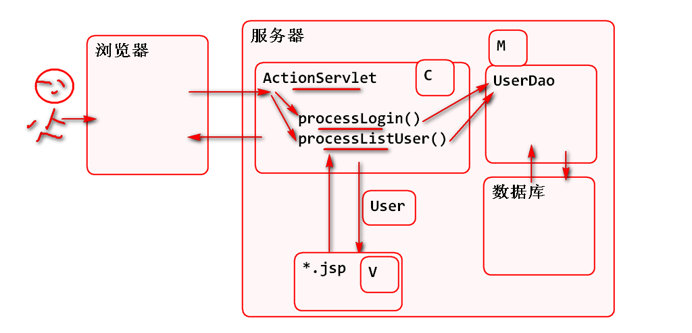
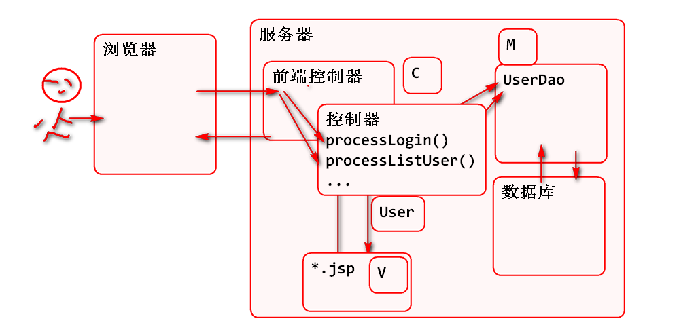
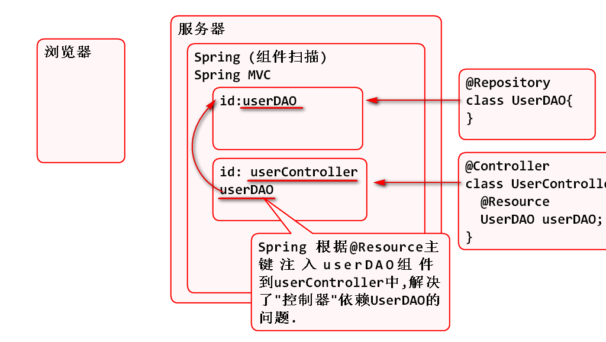

2018年6月20日 Spring Day04
# Spring MVC

Web 应用程序框架, 封装Web应用中常用功能, 只需要按照Spring MVC的约定编写代码, 就可以快速实现Web 应用.

Servlet/JSP MVC:

Spring MVC:

## Spring MVC 项目

1. 搭建 Spring MVC 项目(略)
2. 导入 jdbc dbcp jstl 包 
3. 复制dao层到项目中
	- dao/UserDAO.java
	- entity/User.java
	- util/DBUtil.java
	- jdbc.properties
4. UserDAO.java 添加注解 @Repository
	- 目的: UserDAO 对象由Spring 容器管理
5. 添加applicationContext.xml 用于扫描dao包中注解
	
		<context:component-scan base-package="dao"/>	

6. 导入 JUnit
7. 创建测试案例, 测试UserDAO 对象

8. 复制视图JSP到webapp
	- css/*
	- img/*
	- /WEB-INF/*.jsp
9. 删除 header.jsp 中的自定义标签
10. 开发控制器UserController

		@Controller
		public class UserController {
			
			@Resource
			private UserDAO userDAO;
			
			@RequestMapping("/list.do")
			public String listUser(ModelMap model){
				List<User> list=userDAO.findAll();
				//向listUser.jsp页面传输users集合
				model.put("users", list);
				//转发到 listUser.jsp
				return "listUser";
			}
		}
	
	> 利用@Resource注解, 注入了userDAO, 解决了控制依赖DAO的问题, @Resource注解必须在Spring容器才能使用

	

11. 添加Spring容器的初始化监听器 web.xml:

		<!-- ContextLoaderListener 是由Spring MVC提供
		用于在Web环境中初始化 Spring 容器, 是Spring MVC
		推荐的Spring 容器初始化方式. 一般利用这个监听器
		初始化软件的业务层和数据层. 需要利用context-param
		来设定配置文件位置! -->  
		  <listener>
		    <listener-class>org.springframework.web.context.ContextLoaderListener</listener-class>
		  </listener>
		  <context-param>
		  	 <param-name>contextConfigLocation</param-name>
		  	 <param-value>classpath:applicationContext.xml</param-value>
		  </context-param>

12. 更新了 spring-mvc.xml

		<!-- 视图解析器 -->
		<bean id="jspViewResolver" 
			class="org.springframework.web.servlet.view.InternalResourceViewResolver">
			<property name="prefix" 
				value="/WEB-INF/"/><!-- 删除 jsp/ -->
			<property name="suffix" 
				value=".jsp"/>
		</bean>
		
		<context:component-scan 
			base-package="controller"/>

	> 更新内容:视图的位置和控制器组件扫描的位置.

12. 测试:

		http://localhost:8088/spring-mvc-d2/list.do

## 添加用户功能

重用了项目的jsp界面, 所以实现添加功能非常简单:

1. 在控制器UserController中添加显示添加界面的控制器方法

		/**
		 * UserController 添加控制器方法, 处理toAdd.do
		 * 请求, 显示 添加用户的addUser.jsp页面
		 */
		@RequestMapping("/toAdd.do")
		public String toAdd(){
			return "addUser";
		}

2. 在控制器UserController中添加保存用户信息的控制器方法
		
		/**
		 * 处理添加用户请求 add.do
		 * 获取表单中的信息, 
		 * 保存到数据库,
		 * 重定向到 list.do
		 */
		@RequestMapping("/add.do")
		public String add(
				String username, 
				String pwd,
				String phone, 
				String email){
			
			User user = new User();
			user.setUsername(username);
			user.setPwd(pwd);
			user.setPhone(phone);
			user.setEmail(email);
			userDAO.save(user);
			//返回redirect前缀的返回值时候,Spring MVC
			//会发起重定向响应, 重定向到 list.do
			return "redirect:list.do";
		}

3. 测试..

		http://localhost:8088/spring-mvc-d2/toAdd.do

## 为用户界面添加表单检验功能

软件开发中用户表单中的数据填写的随意性, 所以一定要在保存之前进行数据合法性检验:

1. 客户端JS表单数据检验, 其好处是用户体验好, 但是安全性差可以被绕过.
2. 服务器端一定要对数据进行重复检验, 这样就可以避免客户端脚本被绕过, 进而更加安全了.

实现服务器端数据检验:

1. 在控制器方法参数注入 ModelMap 用于在出现错误情况下向JSP界面发送错误信息.
2. 在出现数据异常情况下, 转发到输入界面, 让用户继续输入:

		@RequestMapping("/add.do")
		public String add(
				String username, 
				String pwd,
				String phone, 
				String email,
				ModelMap model){
			
			//检验添加用户的表单功能
			if(username==null ||
					username.trim().isEmpty()){
				model.put("usernameErr",
						"必须填写用户名");
				return "addUser";
			}
		...

3. 更新 addUser.jsp 在出现错误时候显示错误消息:

		<td valign="middle" align="right">
			用户名:
		</td>
		<td valign="middle" align="left">
			<input type="text" 
			class="inputgri" 
			name="username"/>
			${usernameErr}
		</td>

## 表单数据保持问题

上述添加用户时候, 一旦用户输入信息有异常, 在重新转发到addUser.jsp 表单后, 表单中填写的数据项目会消失, 用户体验很差. 

为了解决上述问题 Spring MVC 提供了 @ModelAttirbute 用来将控制器方法中的数据保存到传递到JSP界面的ModelMap中. 这样在JSP中利用EL表达式就可以再表单中重新显示表单数据.

原理:

实现步骤:

1. 重构控制器方法, 添加@ModelAttribute注解

		/**
		 * 处理添加用户请求 add.do
		 * 获取表单中的信息, 
		 * 保存到数据库,
		 * 重定向到 list.do
		 */
		@RequestMapping("/add.do")
		public String add(
				@ModelAttribute(name="username") 
				String username, 
				String pwd,
				@ModelAttribute(name="phone") 
				String phone, 
				@ModelAttribute(name="email")
				String email,
				ModelMap model){
		...

	> 其中 name="username" 是指定保存到ModelMap中的key

2. 更新addUser.jsp, 使用value="${username}"等回显表单数据

		<tr>
			<td valign="middle" align="right">
				用户名:
			</td>
			<td valign="middle" align="left">
				<input type="text" 
				class="inputgri" 
				name="username" 
				value="${username}"/>
				${usernameErr}
			</td>
		</tr>

3. 测试: 在表单出现错误的情况下, 会回显输入的数据.

## 实现登录功能

登录功能和添加功能非常类似, 也是两次请求

1. 第一次显示登录表单界面
2. 第二次接收表单数据验证登录是否成功

实现步骤:

1. 添加控制器方法显示登录界面

		/**
		 * 显示登录界面
		 */
		@RequestMapping("/toLogin.do")
		public String toLogin(){
			return "login";
		}

2. 添加控制器方法处理器登录表单请求

		/**
		 * 处理登录请求的控制器方法
		 */
		@RequestMapping("/login.do")
		public String login(
				@ModelAttribute(name="username")
				String username, 
				String pwd, 
				ModelMap model){
			if(username==null||
					username.trim().isEmpty()){
				model.put("login_failed", 
						"用户名不能为空");
				return "login";
			}
			if(pwd==null || pwd.trim().isEmpty()){
				model.put("login_failed", 
						"密码不能为空");
				return "login";
			}
			User user = userDAO.find(username);
			if(user==null){
				model.put("login_failed", 
						"用户名或密码错误");
				return "login";
			}
			if(user.getPwd().equals(pwd)){
				System.out.println("Success");
				return "redirect:list.do";
			}
			model.put("login_failed", 
					"用户名或密码错误");
			return "login";
		}

3. 更新登录界面与控制器配合处理登录错误情况 login.jsp

		<td valign="middle" align="left">
			<input type="text" 
			class="inputgri" 
			name="username" 
			value="${username}"/>
			
				${login_failed}
			
		</td>

4. 测试

## Spring MVC 访问Session

在软件开发中经常需要访问Session, Spring MVC也提供了优化, 只需要在控制器方法中添加 HttpSession参数即可, Spring MVC在工作时候会自动的将session对象

> 不仅可以在控制器方法中注入 HttpSession 对象, 还可以注入 HttpServletRequest对象和HttpServletResponse对象.

将登录信息保存到 Session 中

1. 重构 登录验证方法, 添加HttpSession参数, 并且更新登录逻辑, 在登录成功时候, 将用户信息保存到 session中:

		/**
		 * 处理登录请求的控制器方法
		 */
		@RequestMapping("/login.do")
		public String login(
				@ModelAttribute(name="username")
				String username, 
				String pwd, 
				ModelMap model, 
				HttpSession session,
				HttpServletRequest request,
				HttpServletResponse response){
			if(username==null||
					username.trim().isEmpty()){
				model.put("login_failed", 
						"用户名不能为空");
				return "login";
			}
			if(pwd==null || pwd.trim().isEmpty()){
				model.put("login_failed", 
						"密码不能为空");
				return "login";
			}
			User user = userDAO.find(username);
			if(user==null){
				model.put("login_failed", 
						"用户名或密码错误");
				return "login";
			}
			if(user.getPwd().equals(pwd)){
				System.out.println("Success");
				session.setAttribute(
						"loginUser", user);
				return "redirect:list.do";
			}
			model.put("login_failed", 
					"用户名或密码错误");
			return "login";
		}

2. 重构 header.jsp 显示session中的用户信息, 用于验证session信息.

		${loginUser.username}

3. 测试

## 删除功能

添加控制器方法即可:
	
	@RequestMapping("/del.do")
	public String del(Integer id){
		userDAO.delete(id);		
		return "redirect:list.do";
	}