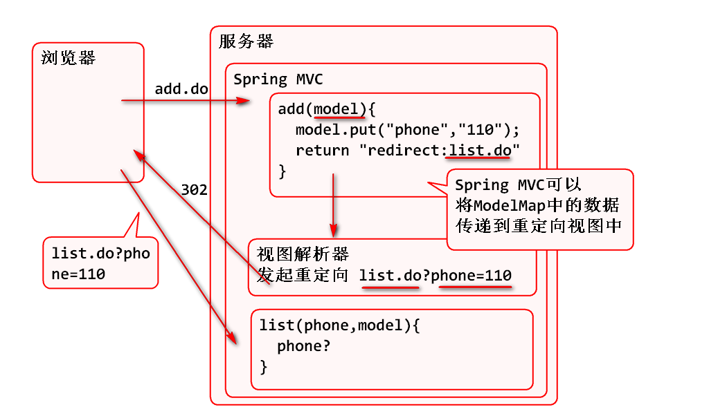
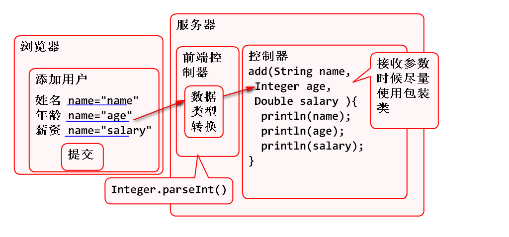
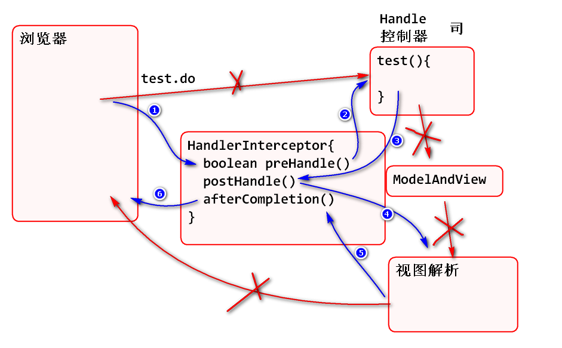
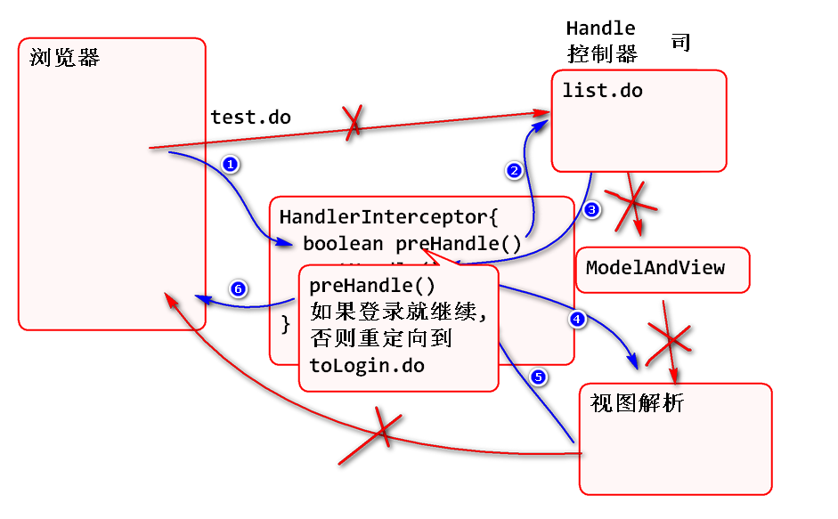
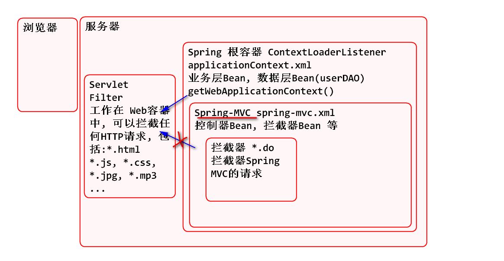
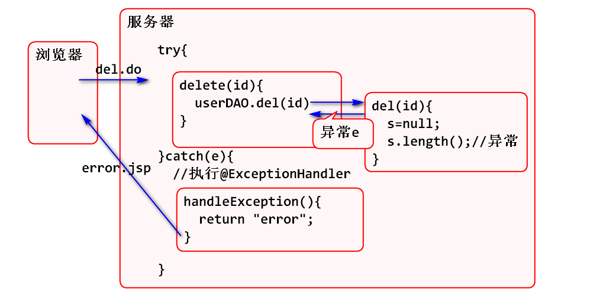

2018年6月21日  Spring Day05

## Spring MVC 重定向参数传递

Spring MVC 控制器向视图界面传递参数时候, 不仅能够向转发视图传递参数, 而且还能向重定向视图传递数据:

## Spring MVC 数据类型转换

Spring MVC 在接收浏览器参数时候, 可以进行自动数据类型转换, 为了更加方便的接收参数, 建议使用包装类接收参数:

## Spring MVC 拦截器(Interceptor)

Spring MVC 提供了与 Servlet Filter 类似的拦截器功能, 其执行原理为:

演示案例:

1. 编写拦截器类:

		@Component 
		public class DemoInterceptor implements HandlerInterceptor {
			
			/**
			 * 在控制器之前执行
			 */
			public boolean preHandle(HttpServletRequest request, HttpServletResponse response, Object handler)
					throws Exception {
				System.out.println("preHandle");
				return true;
			}
			/**
			 * 在控制器之后执行
			 */
			public void postHandle(HttpServletRequest request, HttpServletResponse response, Object handler,
					ModelAndView modelAndView) throws Exception {
				System.out.println("postHandle");
			}
			/**
			 * 视图处理以后执行
			 */
			public void afterCompletion(HttpServletRequest request, HttpServletResponse response, Object handler, Exception ex)
					throws Exception {
				System.out.println("afterCompletion");
			}
		
		}
		
2. 在spring-mvc.xml 配置拦截器
	
		<!-- interceptor 拦截器
		在 spring-mvc中配置拦截器的拦截位置 -->
		<mvc:interceptors>
			<mvc:interceptor>
				<!-- mapping 用于设定拦截器的拦截位置 -->
				<mvc:mapping path="/test.do"/>
				<!-- 引用@Component注解声明的Bean demoInterceptor -->
				<ref bean="demoInterceptor"/>		
			</mvc:interceptor>
		</mvc:interceptors>	

3. 添加控制器方法:

		@RequestMapping("/test.do")
		public String test(){
			System.out.println("test()");
			return "test";
		}

4. 测试

		http://localhost:8088/spring-mvc-d2/test.do

利用拦截器可以解决权限管理问题:

步骤:

1. 编写拦截器:

		/**
		 * 继承HandlerInterceptorAdapter的好处是
		 * 可以减少实现HandlerInterceptor接口时候的空方法.
		 * 称为: 适配器(Adapter)模式! 
		 */
		@Component
		public class AccessInterceptor 
			extends HandlerInterceptorAdapter{
		
			@Override
			public boolean preHandle(
					HttpServletRequest request, 
					HttpServletResponse response, 
					Object handler)
					throws Exception {
				//检查用户是否登录
				User user=(User)request.getSession()
						.getAttribute("loginUser");
				if(user==null){
					System.out.println("没有登录");
					String path="toLogin.do";
					response.sendRedirect(path);
					return false;
				}
				return true; 
			}
		}

2. 配置拦截器 spring-mvc.xml

		<!-- 配置权限拦截器 -->
		<mvc:interceptor>
			<mvc:mapping path="/*.do"/>
			<!-- exclude-mapping配置放过的请求 -->
			<mvc:exclude-mapping path="/toLogin.do"/>
			<mvc:exclude-mapping path="/login.do"/>
			<ref bean="accessInterceptor"/> 
		</mvc:interceptor>

3. 部署测试, 没有登录就会转到登录页

## Servlet Filter 与 拦截器

Servlet Filter 是工作在Web容器中, 其拦截范围非常宽, 任何HTTP请求都可以被拦截处理

Spring MVC 拦截器, 工作在Spring MVC容器中, 只能拦截Spring MVC的请求.

拦截*.css *.js的案例:

1. 编写过滤器

		public class DemoFilter implements Filter{
			public void init(FilterConfig config) 
					throws ServletException {
			}
			public void doFilter(ServletRequest request,
					ServletResponse response, 
					FilterChain chain)
				throws IOException, ServletException {
				HttpServletRequest req=
						(HttpServletRequest)request;
				StringBuffer url=req.getRequestURL();
				System.out.println(url); 
				chain.doFilter(request, response); 
			}
			public void destroy() {
			}
		}
		
2. 配置:
	
		<filter>
			<display-name>DemoFilter</display-name>
			<filter-name>DemoFilter</filter-name>
			<filter-class>controller.DemoFilter</filter-class>
		</filter>
		<filter-mapping>
			<filter-name>DemoFilter</filter-name>
			<url-pattern>*.css</url-pattern>
		</filter-mapping>
		<filter-mapping>
			<filter-name>DemoFilter</filter-name>
			<url-pattern>*.js</url-pattern>
		</filter-mapping>

3. 测试, 需要清理浏览器缓存.

## Spring MVC 异常处理

软件在运行过程中很有可能出现异常, 而在控制器中进行大量的try catch编码显然是非常繁琐的, Spring MVC提供了异常方案, 可以大大简化异常的处理.

Spring MVC 中可以使用多种异常处理

1. 在控制器中直接使用try ... catch 语句进行处理.
2. 在控制器中使用 @ExceptionHandler 注解进行异常处理. 
3. 在Spring MVC 配置文件中进行异常处理.

> 目前最常用的方式是使用 @ExceptionHandler 注解进行异常处理

案例步骤:

1. 在控制器中添加异常处理方法
	
		/**
		 * 当控制器出现 Exception 类型异常时候
		 * 会执行 handleException 方法
		 * 利用 @ExceptionHandler 注解处理异常的
		 * 好处是可以避免每个控制器方法中都写 
		 * try...catch 来处理异常.
		 * 在 异常处理方法中不能使用 ModelMap 参数!
		 * @param e 控制器方法中出现的异常
		 * @return 视图名
		 */  
		@ExceptionHandler(Exception.class)
		public String handleException(
				Exception e, 
				HttpServletRequest request){
			e.printStackTrace();
			request.setAttribute(
					"msg", "异常:"+e.getMessage());
			return "error";
		}

	> 注意: 在异常处理方法中不能注入 ModelMap 对象!

2. 为软件添加测试异常:

		/**
		 * 删除用户
		 */
		public void delete(int id){
			Connection conn = null;
			PreparedStatement ps = null;
			try {
				String s = null;
				s.length(); //引起异常
				conn = DBUtils.getConn();
				String sql = "DELETE FROM t_user "
						+ "WHERE id=?";
				ps = conn.prepareStatement(sql);
				ps.setInt(1, id);
				ps.executeUpdate();
			} catch (Exception e) {
				e.printStackTrace();
				throw new RuntimeException(e);
			}finally{
				DBUtils.close(conn, ps, null);
			}
		}
		
	> String s = null; s.length(); 会引发空指针异常

3. 测试, 在执行删除功能时候, 会跳转到异常处理页面.

## 文件上载(上传 upload)

HTTP协议支持文件上载功能, 具体内容请参看 [http://doc.tedu.cn/rfc/rfc1867.txt](http://doc.tedu.cn/rfc/rfc1867.txt "RFC1867")

原理:

浏览器和Spring MVC按照这个 RFC1867 标准实现文件上载, 具体步骤

1. 客户端 
	- 使用form 标签并且使用 method="post" 和 enctype="multipart/form-data"
	- 使用 input type=file 选择文件
2. 服务器端
	- 导入 commons-fileupload
	- 在Spring中配置 multipartResolver 组件
	- 在控制器利用 MultipartFile 接收文件

案例步骤:

1. 编写客户端 upload.html

		<h1>文件上载</h1>
		<!-- 文件上载表单必须有 method="post"
		 和 enctype="multipart/form-data" -->
		<form  action="upload.do" method="post"
			enctype="multipart/form-data">
			

				<label>选择文件</label>
				<!-- input type="file" 用于选择上载文件 -->
				<input type="file" name="image"> 
			

			

				<label>说明</label>
				<input type="text" name="memo">
			

			<input type="submit" value="上传">  
		</form>	
	
	> 提示: 利用浏览器的F12可以检查文件上载的http消息

2. 在项目中导入 commons-fileupload 组件

		<dependency>
			<groupId>commons-fileupload</groupId>
			<artifactId>commons-fileupload</artifactId>
			<version>1.3.3</version>
		</dependency>

3. 在spring-mvc.xml 中配置上载解析器

		<!-- 配置文件上载解析器 -->
		<bean id="multipartResolver"
		    class="org.springframework.web.multipart.commons.CommonsMultipartResolver">
			<!-- 设置上载编码, 否则中文文件名会乱码 -->
			<property name="defaultEncoding" 
				value="utf-8"/>
		   <!-- one of the properties available; the maximum file size in bytes -->
		   <!-- 最大上载总字节数 -->
		   <property name="maxUploadSize" 
		    	value="10000000"/>
		</bean>

4. 编写控制器方法:

		//method=RequestMethod.POST 限定
		//用户提交的请求必须是 post 请求,
		//如果不是post请求, 则会出现500错误
		@RequestMapping(value="/upload.do",
				method=RequestMethod.POST)
		public String upload(
				MultipartFile image,
				String memo, 
				HttpServletRequest request)
			throws Exception {
			//文件相关信息从image对象中获取
			//获取文件名
			String filename = 
					image.getOriginalFilename();
			//获取文件长度
			long length=image.getSize();
			//获取文件中全部的数据
			//byte[] data=image.getBytes();
			//获取<input name="?"> name 属性值
			String name=image.getName();
			
			System.out.println(filename);
			System.out.println(name);
			System.out.println(length);
			System.out.println(memo);
			
			//保存到文件 Linux: /home/soft01/files
			//File dir = new File("D:/files");
			
			//获取Tomcat中实际的路径: 
			//servletContext.getRealPath()
			String path="/files";
			path=request.getServletContext()
					.getRealPath(path);
			System.out.println(path);
			
			//将文件保存到Tomcat的实际路径中:
			File dir=new File(path);
			if(!dir.exists()) dir.mkdir();
			File file = new File(dir, filename);
			//保存到文件
			//image.transferTo(file); 
			
			//利用流保存文件
			InputStream in=image.getInputStream();
			FileOutputStream out=
					new FileOutputStream(file);
			int b;
			while((b=in.read())!=-1){
				out.write(b);
			}
			in.close();
			out.close();
			return "ok";
		}
		
5. 测试....

