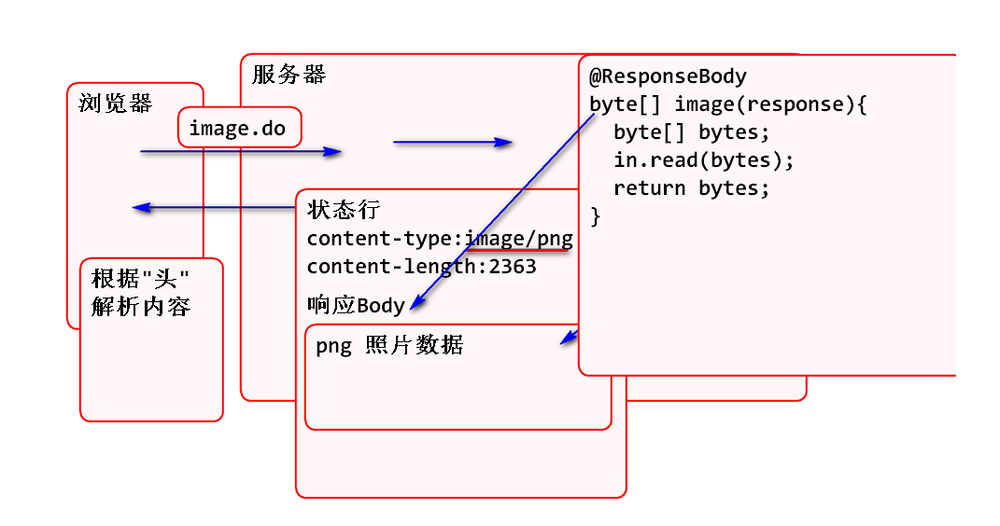
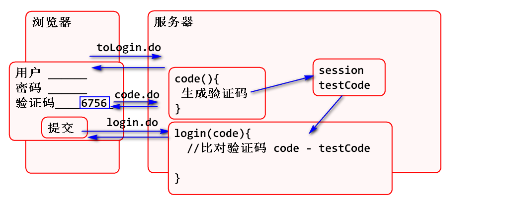
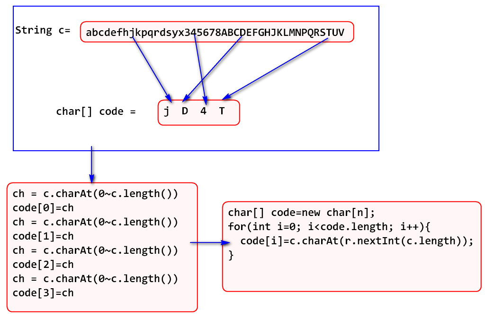
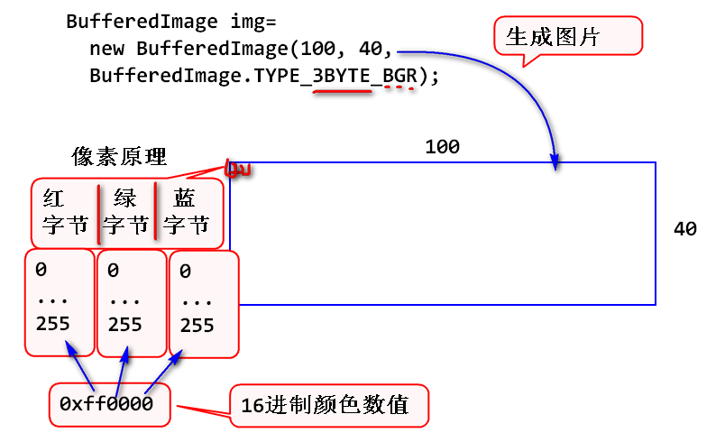
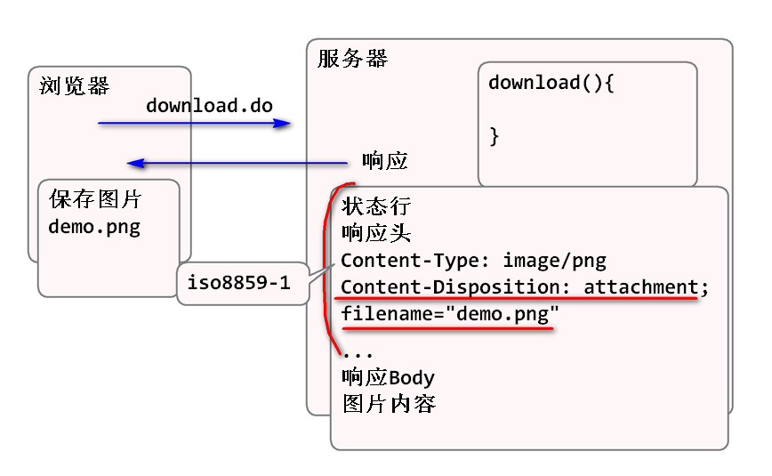
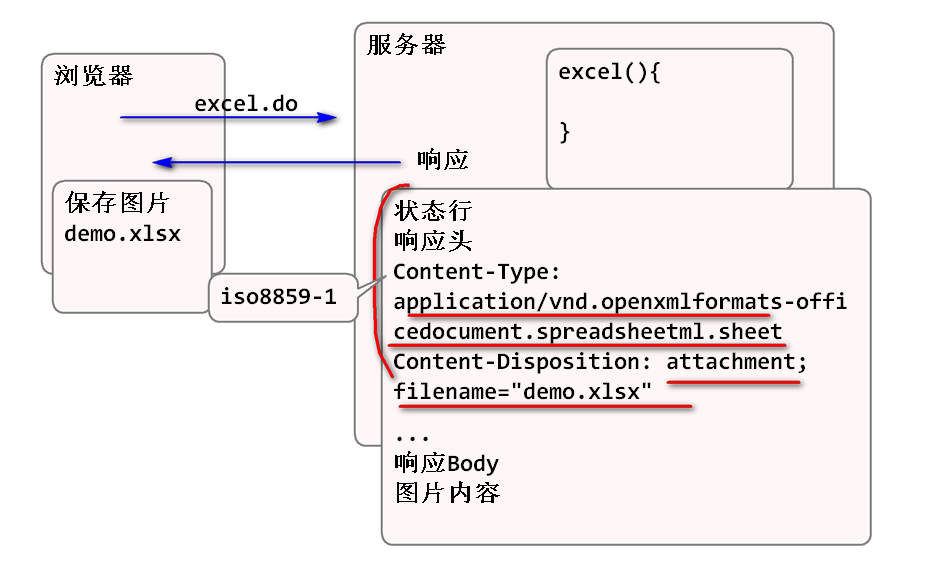
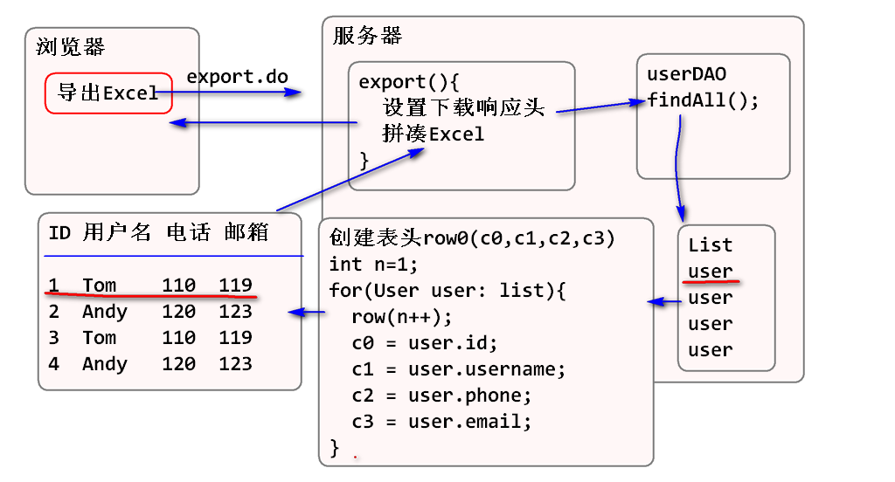

2018年6月22日 Spring Day06

## Spring MVC 文件下载

### 直接下载图片

Spring MVC 对文件下载做了支持, 原理为:

使用步骤:

1. 编写控制器:
	
		/**
		 * 利用Spring 下载显示一张照片
		 */
		@RequestMapping("/image.do")
		public void image(
				HttpServletResponse response)
			throws Exception{
			//读取照片数据 到 bytes数组中
			String path="D:/1.png";
			byte[] bytes = readFile(path);
			//设置响应头
			response.setContentType("image/png");
			response.setContentLength(
					bytes.length);
			//设置响应正文(Message Body)
			OutputStream out=
					response.getOutputStream();
			out.write(bytes);
			out.close();
		}

		private byte[] readFile(String path) throws FileNotFoundException, IOException {
			File file=new File(path);
			byte[] bytes=
					new byte[(int)file.length()];
			FileInputStream in=
					new FileInputStream(file);
			in.read(bytes);
			in.close();
			return bytes;
		}
	
	> 配置拦截器, 放过image.do请求

2. 利用浏览器测试:

		http://localhost:8088/spring-mvc-d2/image.do

### @ResponseBody注解

Spring MVC 提供了@ResponseBody注解, 这个是一个自动处理响应Body的注解:

1. 当返回值是 byte[] 时候会自动设置ContentLength, 自动填充到 响应body中.
2. 当返回值是Java Bean 时候自动转换为 JSON 字符串(后面讲解)
3. 还有其他功能 ...

原理:

案例:

1. 编写控制器:

		/**
		 * 利用Spring 下载显示一张照片
		 */
		@RequestMapping(value="/image2.do",
				produces="image/png")
		@ResponseBody
		public byte[] image2() throws Exception{
			//读取照片数据 到 bytes数组中
			String path="D:/1.png";
			byte[] bytes = readFile(path);
			//自动设置响应头
			//自动设置响应正文(Message Body)
			return bytes;
		}
	
	> 配置拦截器, 放过image2.do请求

2. 编写网页 download.html:

		<!DOCTYPE html>
		<html>
		<head>
		<meta charset="UTF-8">
		<title>Insert title here</title>
		
		</head>
		<body>
			<h1>下载演示</h1>
			<h2>显示照片</h2>
			

				
				
			

		</body>

3. 测试图片的显示

## 验证码功能

网站经常利用验证码功能, 避免网站被机器自动访问. 其原理为:

实现步骤:

1. 利用控制器生成验证码图片, 并且将验证码保存到Session中.
2. 更新login.jsp 显示验证码
3. 更新登录控制器, 验证处理验证码.

案例:

1. 添加生成验证码的控制器 

		@RequestMapping(value="/code.do",
				produces="image/png")
		@ResponseBody
		public byte[] code(
				HttpSession session) 
				throws IOException {
			String code=code(4);
			//将验证码保存到Session中
			session.setAttribute("testCode",code);
			byte[] bytes=createPng(code);
			return bytes;
		}

		/**
		 * 生成验证码字符串 
		 * @param n 验证码位数
		 * @return 随机的验证码
		 */
		static String c = "abcdefhjkpqrdsyx345678ABCDEFGHJKLMNPQRSTUV";
		public String code(int n){
			char[] code=new char[n];
			Random r = new Random();
			for(int i=0; i<n; i++){
				code[i]=c.charAt(
					r.nextInt(c.length()));
			}
			return new String(code);
		}

	> 验证码算法原理:
	
		
		/**
		 * 生成验证码图片
		 * @throws IOException 
		 */
		private byte[] createPng(String code) throws IOException {
			BufferedImage img=
					new BufferedImage(100, 40, 
					BufferedImage.TYPE_3BYTE_BGR);
			img.setRGB(0, 0, 0xff0000); 
			img.setRGB(50, 20, 0xffff00); 
			Random r = new Random();
			for(int i=0; i<100; i++){
				int x = r.nextInt(100);
				int y = r.nextInt(40);
				int color=r.nextInt(0xffffff);
				img.setRGB(x, y, color); 
			}
			Graphics2D g = img.createGraphics();
			//设置字体
			Font font=new Font(Font.SANS_SERIF,
					Font.PLAIN, 30);
			g.setFont(font); 
			//设置颜色
			g.setColor(new Color(
					r.nextInt(0xffffff)));
			g.drawString(code, 10, 30);
			//创建 "酱油瓶"
			ByteArrayOutputStream out=
					new ByteArrayOutputStream();
			//将图片数据(酱油)倒入 "酱油瓶"
			ImageIO.write(img, "png", out);
			//盖上盖子
			out.close();
			//将"酱油瓶"中的数据(酱油)倒出来 
			byte[] bytes = out.toByteArray();
			return bytes;
		}

	> 绘图原理:
	

2. 更新login.jsp页面显示验证码:

		<tr>
			<td valign="middle" align="right">
				验证码:
			</td>
			<td valign="middle" align="left">
				<input type="text"
				 class="inputgri" name="code" />
				
			</td>
		</tr>

3. 更新登录控制器, 处理验证码:

		/**
		 * 处理登录请求的控制器方法
		 */
		@RequestMapping("/login.do")
		public String login(
				@ModelAttribute(name="username")
				String username, 
				String pwd, 
				String code,
				ModelMap model, 
				HttpSession session,
				HttpServletRequest request,
				HttpServletResponse response){
			String testCode=(String)session
					.getAttribute("testCode");
			//Ignore 忽略  Case 大小写
			if(code==null || 
				!code.equalsIgnoreCase(testCode)){
				model.put("login_failed", 
						"验证码错误");
				return "login";
			}
		...

4. 在拦截器中放过验证码的 url

		<mvc:exclude-mapping path="/code.do"/>

5. 测试...

## 下载保存图片

图片默认情况下, 浏览器进行内联(inline)显示, 如果需要实现下载功能, 则需要设置一个响应头 Content-Disposition 

具体请参看: http://doc.tedu.cn/rfc/rfc2616.txt 的 19.5.1 章节

下载图片的原理是:

案例:

1. 编写控制器:

		@RequestMapping(value="/download.do",
				produces="image/png")
		@ResponseBody
		public byte[] download(
				HttpServletResponse response)
			throws IOException {
			String file = URLEncoder.encode(
					"实例1.png", "UTF-8");
			response.setHeader(
					"Content-Disposition", 
					"attachment; filename=\""
					+file+"\"");
			byte[] bytes=readFile("D:/1.png");
			return bytes;
		}

2. 编写客户端

		<h2>下载</h2>
		

			<a href="download.do">下载图片</a> 
		

3. 测试

不仅能够下载图片而且能够下载Excel:

步骤:

1. 导入Excel API

		<!-- POI 是Apache组织提供的开源 Office API -->
		<dependency>
			<groupId>org.apache.poi</groupId>
			<artifactId>poi-ooxml</artifactId>
			<version>3.17</version>
		</dependency>

2. 编写控制器
	
		@RequestMapping(value="/excel.do",
				produces="application/vnd.openxmlformats-officedocument.spreadsheetml.sheet")
		@ResponseBody
		public byte[] excel(
				HttpServletResponse response)
			throws IOException {
			String file = URLEncoder.encode(
					"实例1.xlsx", "UTF-8");
			response.setHeader(
					"Content-Disposition", 
					"attachment; filename=\""
					+file+"\"");
			byte[] bytes=createExcel();
			return bytes;
		}
	
		private byte[] createExcel()
			throws IOException{
			//创建工作簿(就是Excel文件)
			XSSFWorkbook workbook =
					new XSSFWorkbook();
			//在工作簿中创建工作表
			XSSFSheet sheet=
					workbook.createSheet("演示");
			//在工作表中创建行, 参数是行号 0 1 2 3...
			XSSFRow row = sheet.createRow(0);
			//在行中创建格子, 参数列号 0 1 2 3...
			XSSFCell cell=row.createCell(0);
			//在格子中添加数据
			cell.setCellValue("Hello  World!");
			ByteArrayOutputStream out=
					new ByteArrayOutputStream();
			workbook.write(out);
			workbook.close();
			out.close();
			byte[] bytes=out.toByteArray();
			return bytes;
		}

3. 编写客户端:

		<h2>下载</h2>
		

			<a href="download.do">下载图片</a> 
			<a href="excel.do">下载Excel</a> 
		

4. 测试

## 添加用户列表导出功能

导出原理:

步骤:

1. 编写控制器:

		
		@RequestMapping(value="/export.do",
				produces="application/vnd.openxmlformats-officedocument.spreadsheetml.sheet")
		@ResponseBody
		public byte[] export(
				HttpServletResponse response)
			throws IOException {
			String file = URLEncoder.encode(
					"用户列表.xlsx", "UTF-8");
			response.setHeader(
					"Content-Disposition", 
					"attachment; filename=\""
					+file+"\"");
			byte[] bytes=usersExcel();
			return bytes;
		}
	
		private byte[] usersExcel() 
			throws IOException {
			XSSFWorkbook workbook = 
					new XSSFWorkbook();
			XSSFSheet sheet = 
					workbook.createSheet("用户列表");
			//创建表头
			XSSFRow header=sheet.createRow(0);
			header.createCell(0).setCellValue("编号");
			header.createCell(1).setCellValue("姓名");
			header.createCell(2).setCellValue("电话");
			header.createCell(3).setCellValue("邮箱");
			//将用户信息填充到excel表格中
			List<User> list=userDAO.findAll();
			int n = 1;
			for(User user:list){
				XSSFRow row=sheet.createRow(n++);
				row.createCell(0).setCellValue(
						user.getId());
				row.createCell(1).setCellValue(
						user.getUsername());
				row.createCell(2).setCellValue(
						user.getPhone());
				row.createCell(3).setCellValue(
						user.getEmail());
			}
			//将Excel数据保存到 byte[] 数组中
			ByteArrayOutputStream out=
					new ByteArrayOutputStream();
			workbook.write(out);
			workbook.close();
			out.close();
			byte[] bytes=out.toByteArray();
			return bytes; 
		}

2. 更新客户端listUser.jsp添加导出按钮

		<input type="button" class="button" 
		value="导出到Excel" 
		onclick="location='export.do'"/> 

3. 测试

